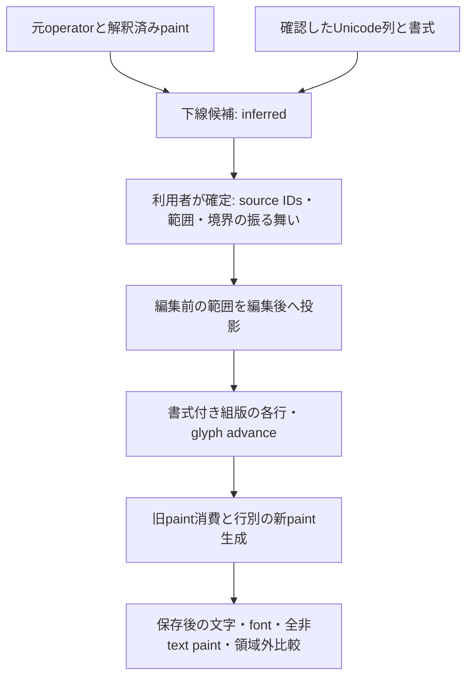

# 文字範囲に追従する装飾と、再編集時の意味境界

2026-09-10。`1649a98` のsource provenance・要素所属モデルを引き継ぎ、**下線がどの文字範囲に属し、文章変更後にどう描かれるべきか**を編集計画へ接続した。root agentだけで調査・実装・検証した。外部原本1件の長文化・短文化・出力PDFの再編集を対象とし、一般業務文書の成功率とはしない。

## 最大の穴と今回の優先順位

前段のモデルは、元命令、rendererで解釈したpaint、利用者が確定する所属を分離できていた。FCC注記では13/13、LibreOfficeページでは4/4のpathがsourceへ戻せ、一式の移動と固定背景内の編集が成立した。一方、`decorates / fixed-to-element` は剛体移動の関係であり、文章の一部が増減した際に3本の下線をどこで分割・伸縮するかを決められなかった。

したがって今回の直近の穴は、**所属から編集時の振る舞いへ進む、論理範囲と装飾の関係**と判断した。既存source対応が通る実PDFでも、このモデルがなければ書式付き文章のreflowはできない。document flow、Form対応、counterfactualの高速化を先に行ってもこの穴は残る。これらの調査を最初から繰り返さず、既存の[比較結果](paint-observation-options.md)と[前段の評価](element-ownership.md)を判断の基点とした。

| 選択肢 | 今回の判断 |
|---|---|
| 全部を同じだけ移動 | 内部の折返し変化を表せない。既存`move-element`へ残す |
| bboxの幅差だけ下線を伸ばす | 部分的な下線・複数行・文字削除の意味を扱えないため採用しない |
| 元のpaintを無条件に障害物から除外 | 古い下線が残るうえ、clip・他の図形を壊すため採用しない |
| 確認したUnicode範囲を編集後の行へ投影 | 今回採用。役割と境界処理を明示し、元paintの除去と新paintの検証を一つの計画にする |
| backend全面置換 | 今回の不足はwriter能力より意味モデル。既存のsource writerと成熟rendererを利用し、置換可能なadapter境界は維持 |

## モデルと実装



`anchors.py` は`SourceParagraph`とelement snapshotのSHA、同じsource・ページ・glyph範囲を要求する。`inspect-anchors` はsource対応が一意な不透明・単色の横向き矩形fillについて、baseline・色・描画順・端点の一致度から候補を提示する。今回の端点残差は最大約0.11ptだが、これは所属の証明ではない。候補もグループも `inferred / requires_confirmation` のまま保存する。

実行用specには、確認したsource ID群、元Unicode列の半開区間、境界挿入時の`inside / outside / reject`を指定する。specの関係は `explicitly_supplied`、sourceとpaintの対応は別の `proven` である。原PDFの座標は観測値であり、意味関係や利用可能幅へ昇格させない。

編集は元Unicode座標の互いに重ならない区間で指定する。内側の挿入・置換・削除で装飾範囲を投影し、完全削除なら装飾も消す。完全置換は同じ装飾範囲を継承する。範囲の端をまたぐ置換は意味が曖昧なので拒否する。grapheme境界とshaped cluster境界も検査する。

組版後は、各行と装飾範囲の交差から先頭・末尾の空白を除き、最初のglyph位置から最後のglyphの実advance終端まで下線を作る。元のbaselineからの距離と太さを保持する。候補間で太さ・距離が一致せず、色・clip・group等の描画contextが異なる場合は拒否する。下線の位置は段落の基準baselineを使い、個々の上付きglyphへ追従する設計ではない。

未変更文字は元resource・code・GIDを保持し、変更区間と明示的に補った空白だけを指定fontでshapeする。下線の長さをfont名や観測文字数から推測しない。`paragraph.py`はtext operatorとpath operatorへの変更を元byte offsetでまとめ、同じ元streamへ適用する。

## 旧paintの除去、clipと固定物

対象は位置redactionではなく、対応を証明した**sourceのpaint operator**である。元のpath構築を残し、paintを`n`または`h n`に置き換えてpathを消費する。最初の対象paint位置に`q ... Q`で新しい下線を描き、元の色・opacity・fill rule・CTM・clipを再利用する。他の下線paintも元source位置で消費する。fill+stroke等、複数paintを生む対象は現在の候補から外す。

新出力は**行ごとに一つのpaint operator**を持つ。一つのpaintで全行の矩形をまとめる案では、次回のsource候補が複数cellとなり、現在の単線役割モデルで再選択できなくなるため採用しなかった。出力を再観測して新しいsource IDとsnapshotを作り直せることを実PDFで確かめた。元specの流用は許可しない。

文字に有効なclipと、下線に有効なclipを別に検査する。下線の新位置・段落領域が下線のclipから外れる、clipの実形状を包含証明できない、paintがclip設定も兼ねる、group/layerがある場合は拒否する。下線がmarked contentに入る場合も、その意味・構造更新をまだ実装していないため拒否する。MCIDを実Structure Treeと同一視しない従来の観測は維持している。

背景・外枠は固定する。背景はsource対応、描画順、実形状の包含、明示的な`backgrounds / fixed-to-page`を全て要求する。置換予定として内部計画に入った下線だけを旧障害物検査から除外する。未選択文字・画像・他のvector・link/annotationとの衝突、ページ端、明示幅・下端は引き続き検査する。文字が収まっても下線だけが下端を越えるケースを拒否試験へ追加した。

FCCの外枠は、遠い角に曲線がある複合fillである。`paint_geometry.py`に一般的な限定証明を加えた。問い合わせ領域と**全ての線分・Bezier制御点の凸包を含む矩形**が離れ、内部点からのrayについて線分のwindingを確定できるときだけ、領域内でfillが一定だと判断する。rayに関わる曲線や領域に接する境界はunknownにする。bboxの内側を穴と見なす処理や、曲線の近似分割は使わない。これは空領域の局所証明であり、丸い背景の包含を一般に証明するものではない。

## 実PDF end-to-end

原本は[公開取得元](https://fccid.io/OVNAC4/Label/Label-Sample-2-3606396.pdf)のFCC資料（Microsoft Print to PDF）。SHA-256は `11ad813fce341afed902f98f7c5335f346bd9e746c648a509c1c7f9ba4f7f3fd`。評価者が注記252glyph・7 text operator、3本の赤い下線が属するフランス語のUnicode区間、固定背景を確認した。幅196ptと下端155ptを明示した。これらのID・座標・文章の条件分岐は評価スクリプトだけにあり、エンジンにはない。

`anchors_release`の結果は[公開集計](../evaluations/anchors/summary.json)に記録した。

| 編集 | 分類 | 物理行 | 下線 | 元glyph保持 / 指定fontのglyph |
|---|---|---|---|---|
| 装飾範囲内に22文字追加 | 成功 | 7→8 | 3→4 | 245 / 22 |
| 装飾範囲を37文字へ置換 | 成功 | 7→5 | 3→1 | 131 / 37 |
| 長文化出力を再選択し、追加した語句を削除。空白・段落境界を再確認 | 成功 | 8→7 | 4→3 | 244 / 2（補った空白） |
| 固定領域の高さを超える長文化 | 安全拒否、出力なし | — | — | — |
| 装飾範囲の端をまたぐ置換 | 安全拒否、出力なし | — | — | — |

原本1件の複数編集であり、3件の独立した実PDF成功ではない。追加に指定したfontはArialMT、face 0、font file SHA-256 `b3658eadae55e682b5f69eb64c439c1ecc8f196c0bb8d4756d145d13bc86476a`。元fontと同一輪郭の代替を保証する評価ではない。

全成功ケースで、編集前のno-opがMuPDFとPoppler 144dpiで全画素一致し、その後に編集へ進んだ。保存後は元glyph・追加CID/GID/`W`、独立pypdfの置換／除去、全非text paint計画、画像、Popplerの領域外差分（1pt margin）を確認した。no-op、編集領域外、除去PDFの領域外は全て変更画素0。下線ごとのPoppler画素も全長にわたり描かれていることを検査した。完成した長文化・短文化・再編集のPNGを目視し、下線・背景・外枠・図・footerを確認した。

この原本は1ページなので「対象外ページが不変」はこの3編集では非該当である。複数ページ不変は合成試験と既存経路の回帰で検査する。公開集計の汎用`other_pages_mupdf_equal`を、多ページの新規実証として数えない。

## 成功に数えなかったPoCと抽出比較の限界

最初の`anchors_candidate/reopen`は、空白なしで物理行を結合した入力だった。自動glyph比較、領域外比較、空白を除去するpypdf比較は通ったが、目視では単語が連結し、段落境界も失われた。出力SHAは `003dba78b4a23b2c81d751929b84feda1df278958b59ee729328e7b42520da09`。これは**レイアウト不自然／入力意味復元の不足**であり、成功から除外した。旧runnerの自動判定をそのまま総合成功と報告しない。

最終評価では、再編集時の`line_joiner=' '`を評価者が指定し、前回確認した論理文章と語境界が一致することを事前に検査した。段落境界は明示的な改行編集として再指定する。編集後も行を空白で結んだ語境界が確認済みの文章と一致するか検査し、画像を見直した。最終出力SHAは `af0ae1a9f419c1337c1c5a88c65179d23a2a171aadf59a5aaf808e43beef3cc4`。

これは自動意味復元の解決ではない。日本語の行間に空白を補う、英単語途中の折返しを空白で結ぶことも正しくない。元PDFや新出力には「この改行はsoft wrap」「これは著者の段落境界」という編集意味を永続化していない。現在のAPIは行結合を呼び出し側に確認させる契約であり、rendererの交換だけでこの情報は得られない。次の編集モデルでは、行ごとの結合指定、編集由来の意味メタデータ、外部原本の不確実な復元を区別する必要がある。

## 再現と回帰

原本は[sources.json](../evaluations/sources.json)に従って取得し、hashを照合する。完全なArial fontとPoppler、独立pypdfのruntimeが必要で、評価helperの既定パスは現在のWindows検証環境に合わせてある。原本、font、派生PDF/PNG、生のsnapshotや抽出ログは公開しない。

```powershell
.\.venv\Scripts\python.exe -m evaluations.anchors.evaluate --run-name local_anchors
.\.venv\Scripts\python.exe -m pytest -q
.\.venv\Scripts\python.exe -m evaluations.elements.evaluate --run-name anchors_regression
.\.venv\Scripts\python.exe -m evaluations.attributed.evaluate --run-name anchors_regression
.\.venv\Scripts\python.exe -m evaluations.composition.evaluate --run-name anchors_regression
```

全体試験は **347成功・2skip**（AES provider不足の既存試験）。実PDF回帰は要素編集 **2成功・3拒否**、書式付き編集 **4成功・3拒否**、全文font代替 **7成功・6拒否**。件数・拒否理由に加え、全ての成功出力PDFのSHA-256が前段の公開集計と一致した。

元resource経路の実PDF評価は今回は再実行していない。`replay`、`slot_edit`、`explicit_reflow`、source parser・selection・保存等の依存モジュールが前段からbyte単位で不変であることを照合し、全体試験と前段の独立実PDF証跡を用いた。前段のStage 1は13成功・2拒否、Stage 2は6成功・7拒否・2skip、Stage 3は13成功・2skip、Stage 4は2成功・1拒否・12skipである。今回の新規実測と過去証跡を混ぜて数えない。

新規試験はUnicode範囲の投影、grapheme、境界挿入、再選択、clipとmarked contentの別scope、複合fillの局所証明、明示下端、固定背景、旧文字・旧下線の除去、CLIの入力／出力保護を対象とする。

## 残る共通原因と次の判断

| 共通原因 | 現在の扱い | 必要な層 |
|---|---|---|
| 装飾の範囲・境界が未確定 | 候補のみ、未確認や境界横断は拒否 | 選択・編集意味モデル |
| soft wrap・hard break・空白が不明 | 呼び出し側の行結合と改行編集を要求 | 段落意味の復元・永続化。単なるbackend交換では不足 |
| 複数行の下線が異なる色・太さ・描画context | 拒否 | 複数装飾styleと役割モデル |
| stroke、波線、任意形状、複数cellの装飾 | 現候補の対象外 | 役割別geometry／writer |
| clip越え、group/layer、marked対象 | 拒否 | 状態・構造を保った再構築backend |
| source対応が重複・Form invocationが共有 | 拒否 | source付きprocessor bridge、Formのcopy-on-write |
| 固定枠・利用可能高さを超える文章 | 保存前に拒否 | 確認したcontainer寸法と要素間制約 |

今回flowへ接続したのは「論理文字範囲→新しい視覚行→付随paint」である。要素間の`follows`、containerのpaddingと伸縮、固定footer、改ページ、表の再組版は未接続であり、下方の物をまとめて移動しない。次の最大の構造課題は、**確認した論理境界を再編集でも保持し、文章の高さが変わったときのcontainer・後続要素の制約へ接続すること**である。先に多ページflowの実装範囲を決めず、意味境界と明示制約で最小の外部PDF例を選ぶ。

provenanceはsource位置と解釈済みpaintを結ぶ責務として残す。現在の全path counterfactualは高コストで、source付きMuPDF processor等へ替える余地がある。ただし置換の判定基準は単なる高速化ではなく、共有Form・clip/group・paint順・構造を元sourceへ安全に戻せる能力とする。上位のUnicode/style/range、利用可能幅のunknown、所有関係と振る舞い、保存後の検証契約は継続利用できる。
