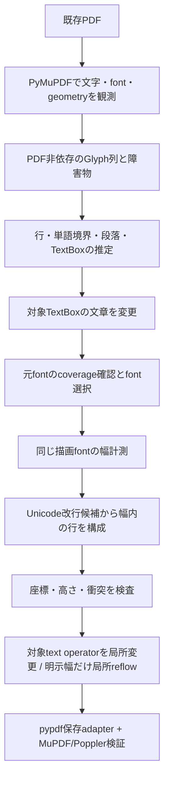

# PDF本文編集エンジンの技術評価

> **編集意味の保存（2026-09-11）**: 通常のPDFと、厳密なPDF hashに結び付く編集用sidecarを分離した。確定した論理文字列・境界・装飾range・固定領域を再編集へ保持し、失効時は観測へ戻す。[persistent-editing-semantics.md](persistent-editing-semantics.md)に判断・実装・実PDF評価を記録する。

調査日: 2026-09-05。既存の `idontlovepdf` 系実装とは独立した検証である。評価対象は、既存PDFの文字配置から編集可能な文章領域を推定し、編集後の文字列を実際のフォント幅で折り返して出力することにある。

> **現在の構成（2026-09-10）**: 元resource忠実経路、全文font代替の局所再組版、元Unicode区間と書式を保持する部分編集を持つ。さらにsource operator・成熟rendererのpaint・呼び出し側が確定する所属を分離し、文字と背景・罫線・下線の局所移動、固定背景内の本文編集を接続した。確認したUnicode範囲の下線を文章変更・折返しへ追従させるモデルと再編集の評価は[anchored-decoration.md](anchored-decoration.md)に記録する。[element-ownership.md](element-ownership.md) が現在の要素モデル・writerの選定・実PDF評価、[attributed-editing.md](attributed-editing.md) が書式付き編集、[composition.md](composition.md) が全文代替経路である。本書の以下は初期モデルと元resource経路の設計資料であり、現行機能一覧はREADMEにまとめる。

## 採用アーキテクチャ

Python + PyMuPDF + unisegを採用し、fontToolsをfontのOS/2 table検査に用いる。PDFの解析・観測と段落推定・レイアウトは分離する。現在の書き戻しは、元の文字コード・font resource・graphics stateを保持したまま、編集対象text operatorを変更する。新しい幅が必要な明示幅reflowだけは限定的な局所再生成を使い、TextWriterを忠実性の既定経路にしない。保存は描画とは独立したpypdf adapterで行う。

初期A--Eの成功範囲は通常の日本語・英数字の横書きと局所的な組版を示すものだった。現在のTrack Aで成立を証明した範囲は、同一styleの単一横書き範囲を元コード・元widthでno-op再描画し、明示幅がある場合だけ局所reflowすることに限る。領域が縦に伸びて他の要素へ達する場合は保存前に停止する。ページ全体のリフローはこのPoCに含めない。

| 層 | 担当 | PDF APIへの依存 |
| --- | --- | --- |
| PDF入出力adapter (`backend.py`, `content_stream.py`, `pdf_save.py`) | `get_texttrace()` と限定 content interpreter によるglyph/state観測、対象 text operator の局所変更、pypdf保存と再検証 | PyMuPDF/pypdfに依存 |
| 内部モデル | `Glyph` / `Run` / `Word` / `Line` / `Paragraph` / `TextBox` / `PageModel`、point単位のgeometry | 依存しない |
| レイアウト推定 (`inference.py`) | 原点・baseline・方向・style・間隔を用いた行、段落、領域候補の構成 | モデルとunisegの語境界APIに依存 |
| フォント選択・計測 (`fonts.py`) | 埋込fontの再利用可否、欠字・書込可否確認、代替理由、実測advance、一定trackingの推定、OS/2 fsType検査 | PyMuPDFとfontTools。上位層へは幅を返す関数として渡す |
| Line / Paragraph Layout (`layout.py`) | Unicode改行候補と利用可能な幅から行を決定、行間と段落境界から座標・高さを再計算 | unisegと幅計測関数に依存し、PDF documentを受け取らない |
| 編集処理 (`engine.py`, `replay.py`, `slot_edit.py`, `explicit_reflow.py`) / CLI (`cli.py`) | legacy推定編集と、手動selectionに対するStage 1--4 gate、別ファイル保存、判断結果のJSON出力 | 上記の層を接続 |

実装では `get_texttrace()` のspanから文字・glyph ID・原点・bbox・font・サイズ・色・方向・描画種別等を取得する。`rawdict` のblock / line構造は利用せず、観測glyph列から行と段落を推定する。対象文字列が見つかった部分だけを座標上で置換するのではなく、その文字列が属するTextBoxの論理文章を編集し、領域内を組み直す。

## 内部モデルと推定

内部型は `pdfeditor/model.py` に置く。座標系は左上原点、右向きx、下向きy、単位はpointに統一する。adapterがPDF固有の座標・resource情報をこのモデルへ変換する。

| 型 | 保持する情報・意味 |
| --- | --- |
| `Rect` | bboxと領域の幅・高さ、包含、交差、和集合。文字のink bboxとテキストを配置できる枠の幅は同一ではない |
| `Style` | 抽出したfont名、point単位のサイズ、RGB色 |
| `Glyph` | Unicode文字列、bbox、baseline原点、観測幅 `advance`、style、方向、取得可能なglyph ID、列内の観測順、編集可能な描画かを示す `visible`。現adapterのadvanceは横書きbbox幅であり、再配置には選択fontで別途計測した幅を使う |
| `Run` | 同じstyleで続くglyph群。PDFの一つの `Tj` と一致する必要はない |
| `Word` | テキスト上の語境界候補とbbox。日本語の意味的な形態素解析を保証するものではなく、英数字の単語やUnicode上の分割単位を扱う |
| `Line` | runs、bbox、baseline、方向、words。PDF上の物理的な行候補 |
| `Paragraph` | 推定上同じ段落に属する物理行と、それらから再構成した論理文章。元の折返しと編集で指定した改行を区別する基点 |
| `TextBox` | ページ、ID、観測bbox、paragraphs、行間、任意の `available_width`、幅を決めた根拠、警告。編集と再レイアウトの単位 |
| `Obstacle` | 文章以外のgeometryと種別。単一領域の拡張が周辺要素に衝突しないか検査する材料 |
| `PageModel` | ページサイズ、glyphs、推定boxes、obstacles、警告。観測をJSONへ出し、推定結果を確認できる |

行の復元は描画順をそのまま連結せず、baseline、方向、文字サイズ、文字間の距離で同一行の候補をまとめる。大きな水平方向の空きは別の領域を示す手掛かりとする。段落と領域は左端・右端の揃い、隣接行の距離、文字サイズ、字下げ、短い文末行等から推定する。文章が短くなった場合に行を詰めるため、同一段落の元の物理的な折返しは論理文章へ吸収する。必要な英単語間空白を補ったglyphには `source_order=-1` を付け、元PDFの除去対象に含めない。語境界はUAX #29の分割であり、日本語の辞書を使う形態素解析ではない。

文字が印字されている範囲だけから、本来の編集枠の右端を一意に復元することはできない。たとえば短い一行だけでは、書き手がその後ろに何pointの余白を想定していたかは不明である。現行モデルは観測幅を `observed_content_width` として記録するが、それを利用可能幅へ暗黙変換しない。strokeを持つ単一矩形などから安全に組版幅を証明できる実装が別途成立した場合だけ `inferred_available_width` に記録し、それ以外は `unknown` のままにする。手動selectionの `--width` は `explicitly_supplied_width` として優先する。

## legacy再レイアウトとStage 4のフォント保持

改行位置は固定文字数で決めない。UAX #14の改行可能位置から、選択fontの実測幅とtrackingで枠内に入る最も長い候補を選ぶ。長すぎて単独でも枠に入らない語は、grapheme境界で緊急分割する。句読点・閉じ括弧・小書きかな等の行頭禁止と開き括弧の行末禁止を追加で適用し、禁則を守れないほど狭い枠では停止する。この禁則集合はPoCのtailoringであり、日本語組版の追込み・ぶら下げまで実装したものではない。

置換文の単一改行は強制改行、二つの改行は空行を挟む段落境界として維持する。空文字への変更は行数ゼロになる。行間は観測baseline間隔を基本とし、選んだfontのascender / descenderが重ならない最低値を確保する。行数と行間から高さを再計算するため、原文の同一段落を二行から一行へ詰める場合は不要な旧行が除去される。`--max-height` またはページ下端を超える場合は停止する。

原文の字間指定をすべてfontのglyph幅に含めると、比例幅fontの違いとtrackingを混同する。legacy経路では観測glyphのadvanceとfont固有の実測幅を比較して拒否する。現行Stage 1--3はこの計測値を再描画writerへ渡さず、元のPDF codeとoperatorの送りを保存する。Stage 4だけは `/W`/`/DW`、Tc/Tw/Tz と text matrix から新文字の送りを計算し、出力後のoriginを検証する。TextWriterのwidth契約は採用しない。

回転ページ・横書き以外の方向、複数style、描画種別がfill以外、低いopacity、optional-content layer、Unicodeの置換文字やglyph ID=-1は拒否する。水平scaleや独自文字幅は、元fontを維持できる場合の観測幅検査でも検出する。一方、現adapterは元の完全なtext matrix、clip、blend stateをモデルへ取り込まないため、すべての変形を検出できるとは保証しない。元fontを代替する場合は元metricsとの照合もできず、こうしたPDFの忠実な再編集は今後の課題である。

現行content interpreterは `q/Q`、`cm`、`W/W*`、text state、ExtGState、marked content、Form invocationを選択text eventへ紐付ける。対象に無関係なscopeのclipだけを理由にページ全体を拒否しない。一方、text clip、非矩形clip、soft mask/blend、Form内の対象など、同じ状態を安全に再現できない場合は対象範囲を拒否する。bboxが一致することだけでclip形状の一致を推論しない。

legacy経路のフォント選択は次の順で判断する。現行backendでは元resourceの再利用を優先し、coverageが不足する場合は後続段階を拒否する。

1. 元PDFのfont resourceからfont bytesを取り出し、編集後の全文に必要なglyphがそのfont内にあるか確認する。利用できれば抽出したfontを計測と描画の両方に用いる。
2. 埋込fontを再利用できず、元のfontが既知のBase-14に対応する場合は同じBase-14のfontを候補にする（legacy経路のみ）。
3. 利用者が代替fontを明示した場合はそのfontのcoverageを確認する（legacy経路のみ）。Stage 1--4は同じfont名だけを根拠に代替せず、必要codeがなければ拒否する。

legacy経路ではfontToolsで読めるfontのOS/2 `fsType` を検査する。現行operator backendはfont programを再埋込せず、元resourceをそのまま保存する。これはfont全体の利用許諾を判定する機能ではなく、CFF / Type1固有の条件や個別契約等を網羅していない。[fontTools TTFont](https://fonttools.readthedocs.io/en/latest/ttLib/ttFont.html) と [OpenType OS/2 fsType仕様](https://learn.microsoft.com/en-us/typography/opentype/spec/os2#fstype) を参照。

font名のsubset接頭辞を外せたことだけを、元fontが再利用できた証拠とはしない。subsetに追加文字のglyphがない、fontが未埋込、抽出bytesからUnicodeとglyphの対応が使えない、という場合は代替が必要になる。代替fontでは日本語の一字幅が近くても、英数字の比例幅やascender / descenderが変わり、改行位置と見た目も変わる。

PyMuPDFの幅計測APIは欠字時に暗黙fallbackを行うため、`has_glyph(..., fallback=False)` による明示的なcoverage確認を先に行う。同じfontをTextWriterへ渡して、計測だけ元font・描画だけ代替fontという食い違いを避ける。[Font API](https://pymupdf.readthedocs.io/en/latest/font.html) の仕様に基づく判断である。

このPoCの文字幅計算は、日英の通常横書きのadvanceを対象とする。shapingを汎用実装する代わりに、結合mark、制御文字（改行以外）、format文字、surrogate、RTL文字と一部のIndic・東南アジア文字範囲を入力段階で拒否する。これはUnicode scriptの完全な対応表ではなく、全scriptの正しい組版を保証しない。将来はHarfBuzz等が返すclusterと位置付きglyph列をモデルへ加え、行確定後にもshapingを検証する必要がある。

## 既存ページへの書き戻し

初期legacy経路では旧文字のbboxをredactionする方式を検査したが、同位置のfill/strokeや背景を文字単位で区別できないため現行backendの既定にしない。現行は選択された `Tj`/`TJ`/quote operatorのcode範囲だけを変更し、元の描画位置へ元codeを戻す。明示幅Stage 4では同じresource/state位置に限定した局所再生成を行う。旧文字を白塗りや不可視化で隠す方式は採用しない。

operatorによる文字除去でも、対象glyphとpaint eventの対応が曖昧なら拒否する。除去直後・再描画前にページを再抽出し、対象外glyphの Unicode、glyph ID、origin、bbox、paint stateの多重集合が保たれることを確認する。旧文字については中間PDFをpypdfで再抽出し、Unicode列が残っていないことも確認する。この検査は構造上到達可能なtextの範囲を対象とし、任意の添付ファイルやメタデータ内文字列の秘匿を保証しない。

既存のredaction注釈は一括適用される可能性があるので、該当ページを拒否する。リンク・注釈・フォームwidgetと編集前後の領域の和集合が交差する場合も、意味と位置を正しく維持する実装がない段階では拒否する。

対象外の文章、画像、線画の境界との衝突を検査する。元TextBox全体を包含する画像・塗りつぶし図形は背景として保持するが、新しい行がその背景の外へ伸びる場合は停止する。矩形罫線は四辺を障害物にし、空の内側を利用可能にする。新しい行が枠内に収まらない場合、fontを自動で小さくして成功扱いにしない。

出力は元ファイルと別の新規パスに作る。同一ファイル・既存出力への書込を拒否し、同じ出力先ディレクトリに一時PDFを保存して、再読込によるページ数と簡易描画を確認する。最後にhard linkの新規作成で出力を確定するため、実行中に同名ファイルができても上書きしない。この確定方法にはhard linkを使えるfilesystemが必要になる。

保存によりobject番号やstream圧縮が変わることはあり、元PDFとbyte単位で同一な未編集領域を保証する方式ではない。検証するのは、編集後の抽出文字・座標・行幅と、未編集要素の見た目の維持である。

## 方式を決める前の比較

以下の適性評価と採否理由は、公式資料のAPI範囲をこのPoCの要件に照らした設計上の判断である。各ライブラリが任意のPDFから元の段落を正確に復元できる、という意味ではない。

### PDF解析・生成・更新

| 候補 | 担当できる処理・利点 | この目的で追加実装が必要な処理 | 判断 |
| --- | --- | --- | --- |
| MuPDF / PyMuPDF | 成熟したPDF解析・描画。文字bbox、座標、フォント、方向、低水準のglyph情報、埋込フォント抽出、PDF更新を一つのバックエンドで扱える | 抽出された行・blockを編集用の段落と領域へ組み直す推定、幅の決定、編集履歴、衝突判定 | 少量の接着コードで入出力と評価画像まで揃い、第一段階のPoCに最も適する |
| PDFium | 文字ごとのUnicode、bbox、原点、フォント情報、ページ描画、ページobject操作と再保存を提供する | 段落推定、shaping、line breaking、変更対象と元objectの対応づけ。C APIと配布バイナリの管理も必要 | 将来の許諾型ライセンス構成の有力候補。今回の短期検証では統合作業が増える |
| Apache PDFBox + FontBox | Javaで既存文書操作、PDFont、CMap、文字位置、埋込フォント、新規contentの生成を扱える。低水準objectとstreamへアクセスしやすい | 文書構造復元、段落組版、選択部分だけ安全に更新するstream処理 | 直接stream編集を主軸とする製品なら再評価。今回はPDF I/O実装よりレイアウト成立の検証を優先 |
| iText Core | Java / .NETでPDF読込・生成・操作と高水準の新規文書レイアウトを扱える | 既存PDFから元の編集構造へ逆変換する処理。複雑文字の高度な組版はpdfCalligraph等の構成確認が必要 | 新規文書生成には強いが、既存本文の逆変換が自動的に解決するわけではない。第一段階には採用しない |
| Rust `lopdf` | PDF object・content操作をRustで扱える。純Rustの処理層を作りやすい | 高精度な文字geometry抽出、レンダリング、フォント選択・shaping、段落組版を別途組み合わせる | 単独では必要な層が足りない。stream操作用部品として検討 |
| Rust `pdfium-render` | PDFiumの高水準Rust wrapper。読込、描画、文字抽出、編集、生成を接続できる | PDFium本体の配布・version整合、上位の文章モデルと組版 | Rust化するときのバックエンド候補。初期PoCの言語選定だけを理由に導入しない |

API範囲は [PyMuPDF文字抽出](https://pymupdf.readthedocs.io/en/latest/textpage.html)、[低水準texttrace](https://pymupdf.readthedocs.io/en/latest/functions.html#Page.get_texttrace)、[PDFium文字API](https://pdfium.googlesource.com/pdfium/+/refs/heads/main/public/fpdf_text.h)、[PDFium編集API](https://pdfium.googlesource.com/pdfium/+/refs/heads/main/public/fpdf_edit.h)、[PDFBox概要](https://pdfbox.apache.org/)、[PDFBox TextPosition](https://pdfbox.apache.org/docs/2.0.13/javadocs/org/apache/pdfbox/text/TextPosition.html)、[iText pdfCalligraph](https://itextpdf.com/products/pdfcalligraph)、[lopdf](https://github.com/J-F-Liu/lopdf)、[pdfium-render](https://github.com/ajrcarey/pdfium-render) を確認した。TextPositionの引用先は2.x APIの説明であり、3.xを採用する際は対応版APIで再確認する。

### 書き戻し方式

| 方式 | 見た目の維持 | 再編集・折返しの精度 | 実装複雑度・対応範囲 | 採否理由 |
| --- | --- | --- | --- | --- |
| Content Streamの直接編集 | 編集対象外を最も細かく保存できる可能性がある | `Tj` / `TJ` 置換だけでは改行できない。テキスト行列、文字間隔、font resource、CID、`ToUnicode`、共有Form XObjectまで追跡が必要 | 高い。operatorと復元文章の追跡関係を持つ必要がある | 最初の方式にはしない。高度な装飾・重なりを持つPDFへ拡張する際の有力な書込バックエンド |
| 対象の文字を除去して再描画 | 画像や罫線を既存ページに残せる。変更範囲を一つの文章領域に限定できる | 自前の編集モデルに基づいて対象領域内を組み直せる | 中。対象の文字と隣接文字がbboxで分離できるPDFに向く | 第一段階に適する。除去に矩形APIを使う場合、対象外文字・リンクの誤除去を防ぐ判定が必要 |
| 全ページを内部モデルから再構築 | 完全なdisplay listを復元できない限り未編集要素も変わり得る | 文章モデルを得られればページリフローを設計しやすい | 非常に高い。clip、透明度、blend、画像、font、描画順を網羅する必要がある | 単一文章領域の成立確認には過剰。ページ全体の正確な再構築を前提としない |
| HTML / DOCX等の中間形式から再生成 | 変換時にレイアウトの解釈が入り、元PDFの位置や字形が変わりやすい | 変換後は既存の組版エンジンを利用できる | 変換器を使えば開始は容易だが、元PDFへの忠実性の管理が難しい | 元PDF上の編集という今回の評価軸に適さない。文章内容を取り出し別文書へ作り直す用途には有効 |

対象文字を除去するAPIとしてredactionを使うことと、墨消しを製品機能として実装することは区別する。このPoCで必要なのは、旧文字が抽出結果に残らず、背景画像・線画を保持したまま新しい文章を描画する書込手段である。[PyMuPDF Pageの除去仕様](https://pymupdf.readthedocs.io/en/latest/page.html#Page.apply_redactions) は、文字bboxに触れる文字、重なるリンク、ページ上の既存redaction注釈への副作用を明記している。

### 言語

| 言語 | このエンジンでの適性 | 初期採否の判断 |
| --- | --- | --- |
| Python | geometry・段落推定を短いコードで検証でき、PyMuPDFとUnicode分割を組み合わせやすい。重いPDF解析・フォント処理はネイティブ側で実行 | PoCに適する。言語自体にPDF組版機能があるための選定ではない |
| C++ | PDFium / MuPDF / HarfBuzz / FreeType / Skiaを直接接続できる。glyph IDや描画stateの精密な制御に向く | 長期ネイティブエンジン候補。ビルド・所有権管理に費やす量が初期検証では大きい |
| Rust | 内部レイアウトモデル、編集transaction、並列処理を型で整理しやすい。PDFiumやHarfBuzzをFFIで使用できる | 性能・配布・保守要件が具体化した段階で有力。すべて純Rustに限定すると成熟PDF機能を再実装しがち |
| C# / .NET | Windows編集UI、DirectWrite等との接続に向く。iTextまたはネイティブPDF backendを利用できる | UIが今回の主目的ではないので先行採用しない。将来UI層として現在のモデルを利用可能 |
| Java | PDFBox / FontBox / ICU4Jと組み合わせたサーバー実装に向く | ライセンスを許諾型OSSへ統一する要件が強ければPDFBox構成は有力。今回は最短の検証構成を優先 |
| WebAssembly | Rust/C++の処理をブラウザに持ち込み、ローカル編集・previewを実現できる | 独立した組版方式ではなく配布先。まずネイティブCLIのモデルと出力を検証し、その後移植性を評価 |

### フォント・Unicode・組版

フォントメトリクス、shaping、line breaking、paragraph layoutは別の責務として扱う。

| 部品 | 解決する範囲 | 解決しない範囲・判断 |
| --- | --- | --- |
| PyMuPDF `Font` | 埋込font bytesや利用可能なfontからのglyph coverage、advance、文字列の幅、ascender / descender取得 | `text_length` の欠字fallbackに注意する。計測と描画で同じfontを用いるため、明示的にcoverageを検査する |
| fontTools | TTF / OTF tableの読込、OS/2 fsTypeの確認 | 現実装ではfont編集やsubset作成には使用しない。条件の一部だけを検査し、利用許諾全体は保証しない |
| FreeType | フォント読込、glyphのadvance / bearing / bbox、ラスタライズ | advanceとink bboxは異なる。文字列の言語依存shaping、行分割、段落推定は担当しない。今回はバックエンドのmetrics APIが使えるため直接導入を省ける |
| HarfBuzz | Unicode列から、font・script・言語・方向に応じたglyph列、cluster、advance、offsetを得る。GSUB / GPOS等の組版 | bidi、複数styleへの分割、行分割、両端揃え、段落推定は別責務。複雑script対応の拡張先として適する |
| Unicode UAX #14 / `uniseg` | 改行可能位置と強制改行の判定。graphemeやword境界もライブラリ化できる | 実際の幅に収まる改行位置は上位層が選ぶ。日本語の厳格禁則・追込み・ぶら下げは追加の組版方針が必要 |
| ICU / ICU4J | localeに応じたbreak iterator、bidi等を統合できる | PDF geometryからの段落復元やPDF出力は担当しない。複数script化ではunisegの置換候補 |
| Skia / SkShaper / 段落組版層 | glyph描画、描画面の共通化、shaping・paragraph処理との接続、PDF新規生成 | 既存PDFを編集モデルへ復元するパーサーではない。SkPDFには描画効果が変換・省略される場合もあり、既存ページ全面再描画の忠実性は別検証が必要 |

metricsとink bboxの違いは [FreeType Glyph Metrics](https://freetype.org/freetype2/docs/glyphs/glyphs-3.html)、PyMuPDFの暗黙fallbackは [Font API](https://pymupdf.readthedocs.io/en/latest/font.html) を参照。shapingの責務は [HarfBuzzの説明](https://harfbuzz.github.io/what-is-harfbuzz.html) と [HarfBuzzが担当しない処理](https://harfbuzz.github.io/what-harfbuzz-doesnt-do.html)、Unicode分割は [UAX #14](https://www.unicode.org/reports/tr14/) と [uniseg linebreak](https://uniseg-py.readthedocs.io/en/latest/linebreak.html)、描画層は [Skia Text API](https://skia.org/docs/dev/design/text_overview/) と [SkPDFの制約](https://skia.org/docs/user/sample/pdf/) を確認した。

locale別の改行処理は [ICU Boundary Analysis](https://unicode-org.github.io/icu/userguide/boundaryanalysis/) で確認した。日本語のstrict / normal / loose等を明示する必要がある段階で、現在の禁則集合と比較評価できる。

PDF内の文字コード、CID、glyph ID、Unicodeは同じ識別子ではない。抽出器が`ToUnicode`やCMapから復元したUnicodeを編集用文字列に用い、fontと座標は独立して保存する。元fontがsubsetの場合、表示済みの文字を描けても追加文字のglyphが存在するとは限らない。PDF内にUnicode対応情報が欠ける場合、正しい字形が表示されるPDFでも編集可能な文字列へ戻せないことがある。

## ライセンス上の選定条件

| 部品 | 確認した条件 | 構成への影響 |
| --- | --- | --- |
| PyMuPDF / MuPDF | AGPL v3、またはArtifexの商用ライセンス | 採用コードに許諾型ライセンスを付けても依存のAGPL義務が消えるわけではない。配布・サービス提供形態でAGPL条件を満たす構成、商用契約、バックエンド差替えのいずれかを製品化時に選ぶ |
| PDFium | BSD形式の本体ライセンス。third-party codeには個別条件がある | バイナリ配布では第三者noticeも含めて確認する |
| PDFBox | Apache License 2.0 | 許諾型のPDFバックエンド候補 |
| iText Core | AGPL、または商用ライセンス | pdfCalligraph等のadd-onをCoreと同じ条件で使えると仮定しない。必要機能と契約構成を個別に確認する |
| lopdf | MIT。リポジトリ内のMontserrat fontは別条件 | コードと同梱fontを区別する |
| pdfium-render | MIT または Apache-2.0を選択可能 | wrapperとPDFium本体の両方の条件を扱う |
| uniseg | MIT | Unicodeデータを含む利用バージョンのnoticeを保持する |
| fontTools | MIT | フォントファイル自体の条件とは区別する。根拠: [fontTools LICENSE](https://github.com/fonttools/fonttools/blob/main/LICENSE) |
| HarfBuzz | Old MIT。部分別ライセンスの案内あり | 採用buildのnoticeを保持する |
| FreeType | FreeType License（FTL）またはGPL v2 | FTLはcredit条項を持つBSD形式。採用する選択肢を明示する |

根拠は [PyMuPDF公式ライセンス案内](https://github.com/pymupdf/PyMuPDF#licensing)、[MuPDF License](https://mupdf.readthedocs.io/en/latest/license.html)、[PDFium LICENSE](https://pdfium.googlesource.com/pdfium/+/refs/heads/main/LICENSE)、[PDFBox](https://pdfbox.apache.org/)、[iTextの権利・ライセンス](https://itextpdf.com/how-buy/legal/copyright-intellectual-property)、[pdfCalligraph導入条件](https://kb.itextpdf.com/itext/installing-itext-pdfcalligraph-for-java-developers)、[lopdfのライセンス](https://github.com/J-F-Liu/lopdf#license)、[pdfium-render LICENSE](https://github.com/ajrcarey/pdfium-render/blob/master/LICENSE.md)、[uniseg License](https://uniseg-py.readthedocs.io/en/latest/license.html)、[HarfBuzz COPYING](https://github.com/harfbuzz/harfbuzz/blob/main/COPYING)、[FreeType Licenses](https://freetype.org/license.html)。ライブラリの条件と、PDFから抽出または外部指定したフォント自身の埋込・再配布条件は別である。

## このPoCの評価方法

単体テストではPDFファイルを開かず、注入した幅計測関数とモデルで行分割・段落再構成・領域の高さを検査する。実fontを使うテストでは比例幅を確認し、PDF統合テストでは別ファイルへ出力した結果を再度開いて文字列・bbox・行数を検査する。PDFのラスタライズ画像でも、行末、文字欠け、不要な旧行、周辺要素への影響を確認する。

| ケース | 成立を示す条件 |
| --- | --- |
| A: 二文字から四文字程度 | 枠内に収まる場合に同じ行へ収まり、元のサイズで自然に再配置される |
| B: 一行から長い文章 | 実測した幅が枠を超える箇所で二行以上になり、各行が利用可能な幅以内に収まる |
| C: 複数行から短い文章 | 同じ段落の古い折返しが除かれ、行数と必要な高さが減る。旧行が抽出文字として残らない |
| D: 日英数字混在 | `i` と `W` 等の比例幅が反映され、日本語・英数字を同じ固定幅として計算していない |
| E: font保持 | 再利用できたfontと代替になったfontを区別し、subset欠字・未埋込等の理由を出力する |

この比較で分かるのは、試験した横書きPDFの文章領域において復元から再配置までが成立するかである。サンプルPDFでの成功を、任意のPDFで正しい段落・枠幅が自動復元できるという結論には広げない。実際の試験手順と結果はREADME、テストコード、生成した評価資料で確認する。

ケースA〜Eの主サンプルは五ページのPDFで構成し、Aでは文字を囲む矩形から推定した枠内に二文字から四文字の編集が収まるか、Eでは完全埋込fontの保持を確認する。別のPDF生成器による入力の検証として、ReportLabの日本語CID fontを使った文書で、未埋込fontからのfallbackと代替理由を確認する。主サンプルの同じbackendによる入出力だけに評価を閉じない。

## 制約が結果に与える意味

第一の制約は、領域と段落が推定であること。PDFが印字位置しか持たない場合、自然な段落境界や本来の枠幅は一意ではない。特に短い行、箇条書き、隣接した別カラム、表のセルは、geometryが近くても別の意味構造を持ち得る。推定モデルの確認・領域指定ができることが、精度向上の前提になる。

行は元TextBoxの左端へ揃えて出力する。字下げや右端の揃いは段落推定の手掛かりには使うが、元のインデント、右揃え、両端揃えを再現する配置規則はまだ持たない。段落間隔も論理的な空行に変換するため、元の任意の段落余白と完全には一致しない。

第二の制約は、fontと文字対応の再利用である。抽出できた字形とUnicodeの関係が不完全なPDFでは、可読な表示が得られていても自然な再編集に必要な情報が足りない。subset欠字の代替による見た目の変化は、単にライブラリを変更すれば解消する問題ではない。元の完全fontまたは適切な代替fontが必要になる。

第三の制約は、局所的な再描画の忠実性である。透明度・重なり・clip・回転・複雑な字間調整を含む文章では、単純な新規テキスト描画が元の描画stateを完全に再現しない。第一段階は観測できる非対応条件を拒否し、通常のfill文字を評価対象にする。ただし完全な描画stateを復元していないため、その検出は網羅的ではない。高度な重なりを編集するには、元の描画objectへの追跡とより精密な書込バックエンドを追加する。

## Adobe Acrobatに近づけるための拡張

| 発展項目 | 必要な情報・処理 | 現方式の延長か |
| --- | --- | --- |
| ページ全体のリフロー | 領域の読み順、同じcolumn、固定objectと追従object、余白、anchor、依存関係、改ページ規則 | レイアウトモデルを拡張できる。文字以外を移動するにはobject単位の書込backendが必要 |
| 表 | 罫線と文字からのcell、行・列、結合cell、余白、行高制約、見出しの繰返し | `Table` / `Cell` と制約計算を追加。セル内のline breakingは再利用できる |
| 縦書き | 縦方向のadvance、縦用glyph置換、句読点位置、縦中横、ルビ、column方向 | 幾何モデルは拡張可能。shapingとglyph出力の刷新が必要で、横書きを回転するだけでは成立しない |
| 段組 | 列境界、列内の読み順、段抜き見出し、列をまたぐ継続文章 | 推定とflowモデルを拡張。現在の単一TextBox組版は列内の部品として利用可能 |
| 図形回避 | 各高さで利用できる横幅の区間、floatのanchor、輪郭、余白 | 固定幅を行ごとの幅関数へ拡張する。単純bbox回避から始められる |
| 複雑font・script | HarfBuzzのglyph cluster、offset、advance、bidi処理、font fallback run、合字とcaret対応 | 幅関数だけでは不十分。位置付きglyphモデルとglyph IDを書けるbackendを追加する |
| 編集UI | glyph / clusterと文字indexの対応、選択範囲、caret、IME、undo、領域ハンドル、confidence表示 | CLIとは別に追加可能。内部モデルと再レイアウト処理を共用する |

### ページ全体リフローの具体的な次段階

まず、同じcolumn内のTextBoxと図・表・画像をノードにしたflow graphを作る。各ノードに固定か追従か、上流ノード、最小間隔、ページ内の境界を持たせる。読み順と描画順は別に保持し、曖昧な関係には利用者による修正を許す。

編集したTextBoxがΔhだけ伸びたら、flow graphの下流にだけ移動要求を伝播する。下に見えるすべてのobjectを一律にΔh移動させる方法では、別column、footer、背景、図のcaptionが壊れる。下流の各ノードについて、移動後の余白・衝突・ページ境界を計算し、必要なら改ページする。縮小時に余白を詰めるかは、固定配置とflow配置の区別に従う。

書き戻しには、文字だけでなく図・表・画像・そのclipや描画順をまとめて移動できる表現が必要になる。Form XObjectが複数ページから共有される場合は、共有定義を直接変更せず編集する配置に必要なコピーを作る。リンクや注釈の矩形・移動先も同じ変換で更新する。この段階では、局所テキスト再描画を残しながら、PDFiumまたはPDFBox等のobject / stream編集backendを併用する案が有力である。

ページを全面的に再構築する方式への移行は必須ではない。編集対象と下流objectだけを書き換える構成を先に評価し、元のclip・透明度・描画順を保持できない場合に限って、より完全なdisplay listの復元へ進む。次段階の最初のPoCは、本文・caption付き図・別column・footerを持つ一枚のPDFで、本文を伸ばしても関係のある要素だけが移動する試験とする。
