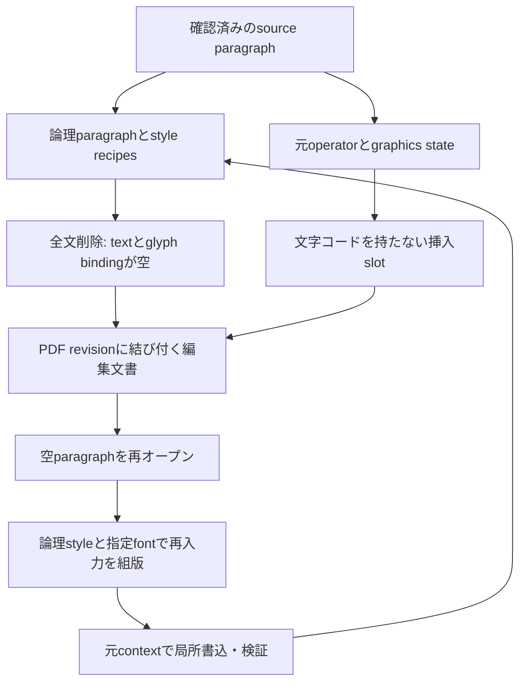

# glyphが0でも残る編集要素

2026-09-11。`727eb70`と[persistent-editing-semantics.md](persistent-editing-semantics.md)を基点とし、root agentだけで実装・検証した。

## 再判断した障壁

前段は確認済みの論理文字列・改行・装飾rangeを保持できたが、出力glyphをstyle witnessにするため、全文削除で要素そのものを保存できなかった。空白になった編集領域へ再入力するだけでもselectionを作り直せない。これを、複数要素やflowに進む前の具体的な構造障壁と判断した。

glyph-independent style仮説は支持された。ただし書式だけでは足りない。最初の実PDF試験では、文字が消えると背景の前後関係の根拠も失い、再入力を拒否した。今回の責務分離は、**論理要素・書式の存在と、PDF上で安全に描ける位置・paint関係を別々に保持すること**である。

| 選択肢 | 今回の判断 |
|---|---|
| glyphの削除とともにparagraphを消し、再選択する | 空白領域をクリックしても元書式・範囲を復元できないため採用しない |
| 見えない文字を残してstyle witnessにする | 旧文字・ダミーglyphを残す設計にしない |
| 独立したstyle recipeと、非描画の挿入位置を保持 | 採用。既存writerとglyph単位の検証を再利用できる |
| 複数paragraph・container伸縮・followsから実装 | 空paragraphの同一性が維持できないまま依存関係を増やすことになるため後続課題 |
| renderer・言語・sidecar保存場所を変更 | 今回の意味欠落の直接原因ではない。source証明不能の範囲は別に記録する |

## 物理bindingと論理styleの境界

`logical_element.py`の`EmptyParagraph`は、glyphを捏造せずに既存の編集・組版入力契約を実装するadapterである。内容ありの`SourceParagraph`と同じwriterへ接続する。`paragraph_from_snapshot`がその違いを扱い、通常の`resolve_selection`に空のglyph選択を許可する変更はしていない。



| 情報 | 意味・根拠 |
|---|---|
| paragraphの存在・確認した範囲 | 呼び出し側が確定した編集対象。本文が空でも存在する |
| `style_recipes` | 元のfont属性・size・横倍率・字間・rise・fill等の観測値と、そのsource PDF hash。glyphがなくても値を保持する |
| `typing_style_id` | 一書式ならその観測書式を継承。複数書式から選ぶ場合は`empty_style_id`の明示指定が必要 |
| font供給 | 保存したfile recipeとhash。再入力では実際のfont programからHarfBuzzで計測し、CID/GID/`W`を生成する。font名だけでcoverageを仮定しない |
| baseline・幅・字下げ・行間・下端 | 前段のlayout値と項目別provenanceを維持。観測幅0を利用可能幅へ昇格させない |
| alignment | 現writerの左揃えを`generated_layout_policy`として記録。元PDFの段落属性を観測したという意味ではない |
| 挿入slot | 元のtext context内に生成した`[] TJ`。文字列operandもglyphもない。byte位置・program hash・font resource・CTM/TM/LM・clip/other stateを保存して照合 |
| 固定背景 | 初回に人が確認したrelationを保持。source操作列と解釈済みpaintを再照合する。空要素のbboxから所有者を決めない |

PDFから独立したstyle値と、現在のPDFへ描くためのrenderer recipeは別である。adapter内部で既存writerの`SourceStyle`へ変換するが、空のparagraphにsource glyphは一つも作らない。空白文字や不可視文字で原文を残す方式でもない。

slotは、元のtext operatorを数値変位へ置き換えて旧文字を除去した位置に設置する。後続文字のtext/line matrixを復元する既存方式を使う。旧本文を新sidecarに保存せず、旧PDF全体hashとstyleの根拠だけを残す。フォントのToUnicode等を保持することと、旧本文をtext operatorに残すことは区別する。

## 背景の関係を空状態へ渡す

`inspect_element`は、空paragraphの検証済みslotを入力としてpaint snapshotを作れる。空状態の`observed_bounds`はnullであり、以前の文字bboxを現在の観測値として表示しない。

通常のglyphがある場合、背景のpaint seqnoが対象文字より前であることを検査する。空の場合は、同じ根拠を捏造できない。そこで、**source対応が証明済みのroot path operatorが、検証済み挿入slotよりprogram上で前にあること**を検査する。確認済み`backgrounds / fixed-to-page`関係、実形状による包含、clipと他の障害物の検査も必要である。後から描かれる覆いを背景指定しても、新文字をその上に描くことは許可しない。

文字だけを変更した世代では、path操作列の件数・順序・operator hashと全解釈済みpath paint値を照合して、固定relationを対応するsource pathへ渡す。対象の候補を近い矩形へ付け直す処理ではない。重複paintのsource対応そのものが証明できない場合は、この順序対応も利用できず拒否する。

文字がなくなると装飾rangeをどう扱うかは別の意味問題である。今回、下線anchor付き要素の全文削除は拒否する。装飾を消すのか、次に入力した文字へ適用するのかを勝手に決めず、paintなしの装飾styleと挿入affinityを扱うモデルを後続課題とする。既存の非空下線編集は維持する。

## 永続化・安全性

出力schemaは`pdfengine-editable-2`。前段のversion 1も読み取り、次の編集時に移行できる。現schemaは一つのparagraphと一つの固定regionだけを持つ。`paragraph-1`、`region-1`はその編集文書内の識別子であり、複数要素管理の完成を示すものではない。

外部再保存、slot位置・state・styleの破損、sidecar喪失は従来どおり確認用の物理観測へ戻す。PDF hashとchecksumは署名ではなく、信頼する編集入力の整合性検査である。暗号化PDFのplaintext sidecar拒否、既存出力を上書きしない契約、二つの出力の通常失敗時rollbackも継続する。

空要素を保存する時点で完全なfontが指定されていなくても、観測書式は保持できる。再入力に必要なfontがなければ、その時点で拒否する。元subsetから消した文字や新しい漢字のcodeを推測しない。明示的にfontを代替した場合は元fontの完全再利用成功と数えない。

## 実PDFの縦断評価

[評価コード](../evaluations/empty_element/evaluate.py)は既存corpusの確認済み範囲を使用する。外部原本に対し、最初に元codeのno-opをMuPDFとPoppler 144dpiで検査する。その後、次の比較を行う。

1. 同じ文章を、指定font・指定幅で直接置換した対照PDFを作る。
2. 全文を削除し、glyphが0のparagraphを保存する。
3. 空状態を再オープンしてno-opする。
4. 元と同じ文章を、style・font・位置・幅を再指定せずに再入力する。
5. 再度全文削除し、新しい文章を入力して保存・再編集する。

再入力PDFと直接置換対照の全画素一致が、空状態で書式・位置を失っていないことの検査である。**指定fontへ置換した対照と一致することを、元PDFとの全画素一致と呼ばない。** 原本の元code no-opは別のgateである。

各世代で全ページの独立pypdf抽出、旧文字の除去、code/GID/`W`、全非text paint、画像、対象外ページ、Poppler領域外画素を検査する。空からの挿入は、出力から新文章を除いた全ページ抽出結果が入力と一致することを検査し、空文字の検索を成功根拠にしない。論理文字列の完全一致と明示改行はsidecarでも検査する。

実PDFは5原本から6範囲を選び、次の境界を確認した。拒否された範囲では、失敗した操作の編集PDFを公開していない。

| 原本・確認範囲 | 結果 | 判断できたこと |
|---|---|---|
| Word・沖縄県の公募公告、導入本文 | 成立 | 日本語＋英数字、明示改行、先頭字下げを保ち、空→再入力→再編集 |
| LibreOffice日本語の新機能紹介、導入本文 | font代替で成立 | IPAPMinchoから明示したMS P明朝へ代替。元fontそのものの再利用成功とは区別 |
| Microsoft Print to PDF・FCC資料、黄色枠内の例示1行 | 固定背景を保持して成立 | 赤い文字のstyle、元の黄色背景relation、周辺の下線・図面・罫線・画像を保持 |
| 仮想プリンタ・Canvia、見出し | 安全に拒否 | 重複fillで2件のsource-to-renderer対応を一意に証明できず、背景所有関係を確定できない |
| LibreOffice Enterprise、standards bullet | 安全に拒否 | 指定fontによる再組版inkが画像bboxへ達する。画像背景の意味・実形状は現モデルで証明していない |
| Microsoft Print to PDF・FCC資料、枠内の英語3行 | 安全に拒否 | 指定fontによる再組版inkが非選択glyph bboxへ達する。隣接文字を移動して空間を作らない |

成立した各範囲は、削除、空no-op、元文章の再入力、再削除、新文章の入力、再編集の6状態を検査した。対象ページの対照比較はMuPDF/Popplerとも全画素一致、全世代のPoppler領域外差分は0。対象外ページはMuPDF全画素と独立抽出を比較して不変だった。Word、LibreOffice、FCCの新文章を表示した最終ページと、Wordの空状態を目視し、重なり・装飾のずれ・周辺要素の変化がないことを確認した。

最初のrunnerはbackend拒否も`failed_evaluation`と表示した。原因調査後、最終runnerは保存先が存在しない`PdfError`を安全拒否として別分類し、独立監査の失敗や公開済み出力の問題とは分けた。仮想プリンタの初回再入力拒否を理由に背景guardを解除せず、明示relationとsource順序の実装へ進み、source対応不能の重複fillは拒否を維持した。英語3行の失敗を削除して例示1行の成功だけを残すこともしていない。

全体試験は **380成功・2skip**（既存AES provider不足）。完全にglyphがないページ、色・横倍率・異方性matrix、複数書式のtyping style確認、固定背景と後描きの覆い、重複paint、壊れたslot、ActualText、font喪失、外部再保存、v1からの移行を含む。

実PDF回帰は前段の`evaluations.editable`を最終コードで実施し、**3世代成功・5条件で安全失効**。3つの出力PDFのSHA-256と5つの拒否理由は全て前段の公開結果と一致した。元resource経路等の変更していない高コストcorpus全体を再実行したとはしていない。

新しい実PDFの成功証跡は、試験中の各runに保存した描画・独立抽出結果を再利用した。その後の変更は、空要素への固定背景関係の追加と、slotに対するblend/mask・ActualText等の拒否検査であり、glyph配置計算の変更ではない。最終コードで、成功3範囲の空状態3世代ずつ、計9件を再オープンし、style・program/context・paint snapshotの復元を再検証した。3拒否範囲は最終コード・最終runnerでも再実行した。公開集計には各runのengine hashと最終再検証のhashを分けて記録し、古い実行を最終コードでの全試験再実行と呼ばない。

```powershell
.\.venv\Scripts\python.exe -m evaluations.empty_element.evaluate --run-name local_empty
.\.venv\Scripts\python.exe -m pytest -q
.\.venv\Scripts\python.exe -m evaluations.editable.evaluate --run-name empty_regression
```

原本・SHA-256・取得元は[manifest](../evaluations/sources.json)、集計は[summary.json](../evaluations/empty_element/summary.json)を参照。原本PDF、派生PDF/PNG、全文・style・slot・paintの生ログは公開しない。

## 接続できた範囲と次の判断

空paragraphを含め、要素の同一性・固定region・書式・確認済み固定背景relationを反復編集へ渡せる。backgroundの矩形を自動的にcontainerへ昇格させていない。paddingはunknown、followsは未宣言、overflowはrejectのままである。別paragraphを移動する処理も、container伸縮や改ページも追加していない。

次の大きな構造課題は、**paintがなくても残る装飾styleと、複数要素の明示的な依存関係**である。現在の独立style recipeは空paragraphの再入力用であり、全ての非空spanを安定した文書style registryへ一般化した最終モデルではない。正規化されたtracking/riseと論理styleの再binding、空白だけの要素、任意のalignmentも制約が残る。

論理要素・style・物理bindingの分離は伸ばすべきである。同時に、重複paint・画像背景等のsource/ownership証明不能が対象文書の主要障壁になる範囲では、source付きprocessor bridgeや画像関係モデルを比較する価値がある。今回の結果から言語変更やrenderer全面置換を必要条件とする根拠は得られていない。
