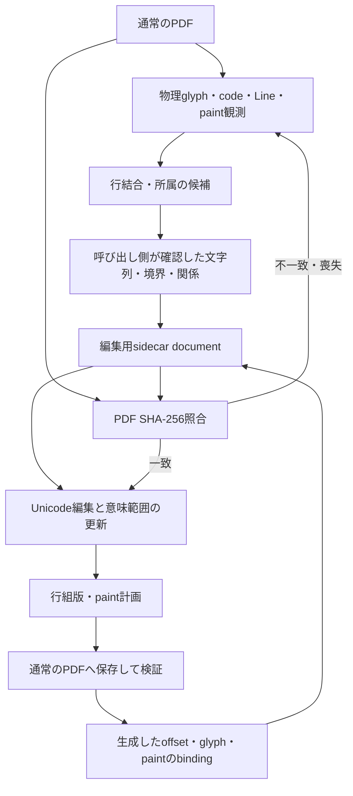

# 物理PDFと、再編集で保持する意味の分離

2026-09-10〜11。`acd56ad`の[装飾anchor評価](anchored-decoration.md)を基点とし、root agentだけで実装・検証した。今回は**確定した論理文字列・境界・装飾範囲・配置条件を、PDFを開き直すたびに物理配置から推定し直していたこと**を最大の障壁と判断した。

## 判断と技術選定

前回の実PDFでは、source glyph・font・paint・領域外画素の検査を通っても、空白なしの行結合が単語を連結した。source対応や下線writerの不足で起きた問題ではない。下線を3本から4本に再生成できても、次の編集でその論理範囲を失えば、編集を積み重ねる文書にはならない。

logical boundary仮説を主要障壁と認めた。containerとflowも重要だが、今回は確認済みの意味を次回へ残す構造を先に実証する。ページ全体flowや別rendererの導入ではこの情報の欠落を埋められない。既存のsource/paint/ownershipを破棄せず、それらへのbindingを持つ編集用の状態を上位へ置いた。

| 保存方法 | 評価と判断 |
|---|---|
| sidecar document | 通常のPDF構造を変更せず、厳密な原本hashで失効を判定できる。PDFとの別送・喪失が弱点。今回採用 |
| PDFのPieceInfo | PDFと一緒に持ち運べる有力な候補。private dataのschema・名前・更新・外部保存後の整合性が必要。後述の意味モデルを埋め込むadapterとして再検討可能 |
| 独自dictionary | PDF内へ置くだけでは内容との整合性や意味を保証しない。PieceInfoとの責務差を説明できる段階で比較する |
| XMP | 文書metadataの交換とは別に、glyph/paint bindingと論理編集モデルのschema・検証が必要。今回の最小実証では選ばない |
| tagged structure | 外部PDFに既にあるTree/ParentTree等は維持対象。編集履歴の保存のためだけに、有効な構造を理解せずタグを作らない |

PDF Associationの資料は、PieceInfoをprivate processor dataの保存方法として説明し、document/pageへの配置、`Private`と`LastModified`、暗号化されたPDFでのprivate strings/streamsの扱いを整理している。更新日時だけを今回の整合性証明にはせず、sidecarでPDF全体のSHA-256を使う。これは保存adapterの選定であり、将来PieceInfo等へ移す場合も論理モデルと検証契約は再利用できる。[Including custom metadata structures in PDF](https://pdfa.org/download-area/publications/Including-custom-metadata-structures-in-PDF.pdf)、[Understanding private data in PDF/A](https://pdfa.org/download-area/publications/Understanding-private-data-in-PDFA.pdf)。PDF/A適合を認証したという意味ではない。

## architectureと根拠の分離



`editable.py`のsidecarは一つの選択要素を保存する。複数ページの文書全体を復元したモデルではない。保存する層を分けた。

| 情報 | 根拠・扱い |
|---|---|
| source PDF、glyph ID、code、font、physical Line、paint | 観測・検証済みbinding。Unicode位置とPDF glyph IDは別の値 |
| elementの所属候補 | `inferred`のまま。保存した候補を自動で確定関係へ昇格させない |
| 論理文字列、明示改行、段落境界、下線range、固定paint関係 | 呼び出し側が確認した編集入力。再編集ではその意味を引き継ぐ |
| soft wrap、各行のglyph配置、再生成した下線 | `generated-by-pdfengine`。論理文字列へ改行を挿入して保存しない |
| x・baseline・字下げ・幅・行間・下端 | 項目ごとの`layout_provenance`。観測値・明示値・生成値を区別し、内部で再利用しただけで明示確認済みへ変えない |
| container padding、後続要素 | paddingはunknown、followsは未宣言。大きな矩形やy順から補完しない |

sidecarは現在の論理本文、各codepointと生成PDF glyphのbinding、段落snapshot、境界、装飾・固定関係、配置条件、必要な指定fontのfile recipeとhashを持つ。過去の本文やundo差分を新sidecarへ格納しない。前世代へのリンクはmodel hashだけである。

復元時もsourceの安全性検査は行う。これは所有関係や行結合の推定し直しではない。PDF全体hashに加え、glyphのUnicode、font resource、code、style witness、選択範囲、paint snapshotを再照合する。論理文字列の非描画文字には空白・CR・LFだけを許し、描画glyphは選択中の全glyphと一対一で対応させる。未知のcontainer動作や、明示改行と一致しない境界は拒否する。

SHA-256とmodel checksumは偶発的な破損・古い版の検出用であり、作者の署名や認証ではない。sidecarは利用者が信頼する編集用入力として扱う。第三者がchecksumを作り直せない、という主張はしない。

## 意味・空白・配置をどう保持したか

論理文章の改行を、生成したsoft wrapとは別に保存する。`hard_break`と利用者が明示した`paragraph_boundary`は別のlabelで、現layoutではどちらも強制改行として描く。段落間隔や別containerへのflowを実装したわけではない。CRLFは二つのcodepointを保持し、一つの境界spanにする。保持された境界labelは元Unicode位置から編集後の位置へ移す。新しい改行はhard breakを既定値とし、段落境界への昇格は明示指定を要求する。

折返し位置で描かれなかった空白も論理文字列へ残す。次の組版で行中へ戻った場合、同じ書式で実際に観測した空白のcode/GIDをwitnessとして再利用できる。この文字は元のpaint occurrenceを保持したものではないため、`source_index`と`code_witness`を分離した。任意の新文字をfont名から補う処理ではない。witnessがなければ保存済みの明示font recipeを使い、そのfile hashを検査する。利用不能なら新しいfont指定を要求する。

先頭の空行はPDFの最初の描画glyphには現れない。最初の可視glyphを毎回baselineの起点にすると、再編集のたびに文章が下へずれる。そのため、組版の起点baseline・行間・字下げも生成時の状態として保存する。先頭空行を持つ再編集の全画素一致を合成試験で確認した。

writerが正規化した結果、元のtracking・word spacing・baseline shift等を現モデルへ復元できない場合は、sidecarを持つ編集を拒否する。従来のPDF編集経路の対応範囲をそのまま「永続化でも対応済み」としない。完全に空になった要素や、paintを持たない装飾も、非glyphのstyle anchorが必要なため現段階では拒否する。

下線の意味rangeと境界挿入のaffinityはそのまま投影し、生成した各線を出力PDFの一意なsource paintへ結び直す。固定背景も元の検証済みpaint値を使う。bboxの近さから所属を再判定しない。highlight・border等を同じ伸縮規則で処理する拡張はしていない。

## PDFとstateの公開、失効とfallback

通常のPDFにprivate metadataや擬似tagged structureは追加しない。保存後のglyph・font・全非text paint・領域外検査が通ったPDFについて、出力code/glyphと意味モデルのbindingも検証し、最後にPDFとsidecarを公開する。どちらかの通常の公開操作が失敗した場合は、この呼び出しが作成した出力だけを取り消す。原本・既存出力は上書きしない。

二つの別ファイルをOSのcrashに対して同時にcommitする保証はない。途中のcrashでPDFだけ残った場合も、PDFは通常どおり読め、意味モデルなしとして確認用の解析へ戻る。hard linkが必要という既存出力契約も継続する。

PDFが1byteでも異なれば、再保存後の見た目が同じでも旧stateを使用しない。`open-editable`は`needs_confirmation / semantics=unknown`と通常の物理観測を返す。`edit-document`はそこで停止し、勝手に行を連結して編集しない。字体・glyph数が似ていることを、旧意味情報が有効という根拠にしない。

これは保守的な失効契約である。外部保存をまたいで自動復帰させるには、単なる表示一致より強いsource/resource/paint/意味範囲の同等性証明が必要になる。現sidecarはplaintextなので、暗号化PDFからの作成・復元は拒否する。PDF内の暗号化されたprivate dataや、編集用文書自体の暗号化を設計するまで、元PDFの保護を黙って弱めない。

## 外部PDFでの縦断評価

原本は前回と同じMicrosoft Print to PDFのFCC資料。SHA-256は `11ad813fce341afed902f98f7c5335f346bd9e746c648a509c1c7f9ba4f7f3fd`。[取得元manifest](../evaluations/sources.json)と[評価コード](../evaluations/editable/evaluate.py)で再現できる。初回だけ252glyph、幅196pt、下端155pt、下線範囲・固定背景・改行2か所の種類を評価者が確認した。

初回は前回の長文化と同じ22文字を追加する。次回はその語句を削除し、3世代目は9文字を追加する。2回目以降はstateとUnicode編集だけを渡し、行結合、改行挿入、下線range、幅、所属、fontを再指定していない。

| 世代 | 意味を確認し直す入力 | 物理行 | 下線 | 追加の文字描画 |
|---|---|---|---|---|
| 初回追加 | 初回の確認を実施 | 7→8 | 4本 | 指定font 22glyph |
| 語句削除 | 不要 | 8→7 | 3本 | 観測済み空白codeの再利用2glyph、指定font追加0 |
| 再追加 | 不要 | 7→7 | 3本 | 指定font 9glyph、空白code再利用1glyph |

これは外部原本1件の3世代であり、3種類のPDF成功ではない。論理文字列の完全一致、明示改行2か所、段落境界label1か所、下線の意味range、固定領域の維持を毎世代検査する。生成した行数の変化を、論理改行の増減と混同しない。

各編集の前に元codeによるno-opをMuPDF/Popplerで全画素比較し、その後に編集する。編集後は独立pypdfの置換／除去、code/GID/`W`、元font、画像、全非text paint計画、Poppler 144dpiの領域外比較を行う。空白を除いた抽出比較だけに依存せず、保存modelの論理文字列・境界も別に照合し、完成PNGを目視する。

初回PDFは前回の出力SHA `77186b4576c7d94f4206567a77adda8dcdf2c6b2c97b72d7f32d40680148d103`と一致した。PDF構造を変えずに意味保持を加えられた対照となる。新規原本は1ページなので対象外ページの実証とはしない。複数ページ不変は合成試験と既存経路の回帰で検査する。

## 外部再保存で確認した別の問題

評価ではsidecar喪失、pypdf再保存、MuPDF再保存、外部での座標変更、sidecar破損を分ける。全て旧意味情報を失効させ、物理観測へ戻し、編集出力を作らないことを検査する。

試作のMuPDF再保存ではPopplerで1,276画素が変化した。glyph ID・origin・bboxはMuPDF観測では一致し、decoded contentも同一だったが、MediaBox/CropBoxとfont metrics・`W`の数値が再直列化で変わっていた。数値変化が視覚差分の原因候補であり、個々の寄与まで分離した実験ではない。これはpdfengineの再編集による差分とは別に扱う。

最初のrunnerは外部保存にもno-op完全一致を要求したため、この差分で試験を停止した。最終runnerでは、外部保存の描画差分を独立して記録した上で、旧stateの拒否とfallbackを検査する。外部保存したPDFを編集するgateを緩めたわけではない。世代ごとの編集前no-op条件は維持している。

最終`editable_release`は **3世代成功・5条件で安全失効**。全世代のno-op・Poppler領域外・除去PDF領域外は変更画素0。pypdfの外部再保存も全画素一致、MuPDFの外部再保存は1,276画素差分だった。どちらも旧stateでは編集しない。結果と回帰は[公開集計](../evaluations/editable/summary.json)へ記録した。原本・派生PDF/PNG・全文・sidecarは公開しない。

## 再現と回帰

```powershell
.\.venv\Scripts\python.exe -m evaluations.editable.evaluate --run-name local_editable
.\.venv\Scripts\python.exe -m pytest -q
.\.venv\Scripts\python.exe -m evaluations.anchors.evaluate --run-name editable_regression
.\.venv\Scripts\python.exe -m evaluations.attributed.evaluate --run-name editable_regression
```

完全なfontとPoppler・独立pypdfのruntimeが必要で、既定パスは現在のWindows検証環境に合わせている。全体試験は **362成功・2skip**（既存AES provider不足）。その後CRLFの境界spanとstate整合性検査を確定し、最終の関連 **16試験全て成功**を確認した。先頭空行、境界kind、空白codeの再利用、壊れたbinding、外部保存、font喪失・変更、公開途中の失敗、暗号化PDF、CLIを含む。実PDF回帰は書式付き編集 **4成功・3拒否**、下線経路 **3成功・2拒否**。成功PDFのSHA-256と拒否理由は全て前段と一致した。変更のない元resource経路・全文font代替・要素移動まで、高コストな実PDF評価を機械的に全て再実行する方針にはしない。

## container・flowへの接続と残る最大の問題

containerは、明示幅・下端、保持した基準baseline等を持つ**固定text region**として保存した。背景・下線との確認済み関係は保持するが、paddingはunknown、followsは未宣言であり、枠の伸縮、後続要素の移動、改ページは実装していない。PDFの大きな矩形をcontainerへ自動昇格させない。

今後の最大の穴は、**一つの選択要素の意味保持を、glyphの有無に依存しない論理style・複数要素・container制約へ接続すること**である。空になった段落へ再入力する、正規化されたtracking/riseを著者の書式として保持する、明示した後続要素だけを追従させる、といった例が判断材料になる。今回保存したboundaryとroleはその入力として使えるが、ページflowが成立したとはしない。

この意味モデルは伸ばす価値がある。一方、保存場所は固定しない。sidecarの可搬性が問題になるならPieceInfo等のadapterを実験し、外部保存をまたぐbindingが必要なら構造・paintの同等性検査を追加する。共有Formやclip/groupを扱う際のsource付きprocessor bridgeも引き続き置換候補だが、論理情報の欠落をrenderer交換で解決したことにはしない。
